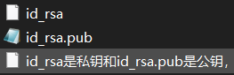

# 入门岛
# 第三关 Git 基础知识
## Git 密钥对配置笔记：
ssh-keygen：（几点没人讲的说明：）

1. 每台电脑密钥对是可以共用的！！！
也就是说你可以指定一个密钥对去登陆各种远程主机！没必要生成很多个密钥对，难管理。但共用密钥对安全性没有多个密钥对高。

2. 所有终端，只要能运行ssh-keygen都可以创建密钥对，包括git bash、cmd、powershell等等，只要有ssh-keygen工具的环境都是可以创建密钥对。

   ssh-keygen -t rsa -b 4096 -C "your_email@example.com"

   -t 是加密方法，不指定也可以，比如GITHUB可以不指定。不指定的密钥会比较短，指定rsa加密方法的密钥会比较长。最好指定，好像有此SSH远程必须用rsa加密，比如这个本课程中的开发机。

   -C（大写的C）注释，公钥的末尾会变成...your_email@example.com,一般没必要。
   -b 加密后的密钥长度，rsa一般2048或4096,一般不指定；

3. <u>C:\Users\用户名\.ssh</u> &nbsp;&nbsp;&nbsp;是你的密钥对存放的位置，长这样，都可以用记事本打开：

   

   ### 共用密钥对有个麻烦事儿就是你一旦删除了上述文件夹的密钥对，所有的远程都嗝屁了并需要重新配置；