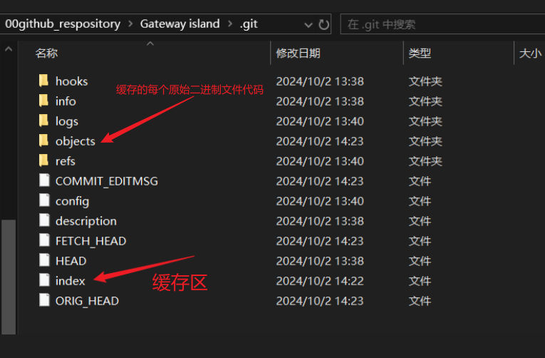
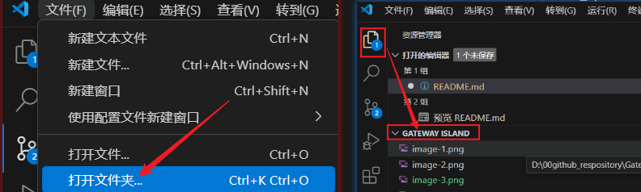
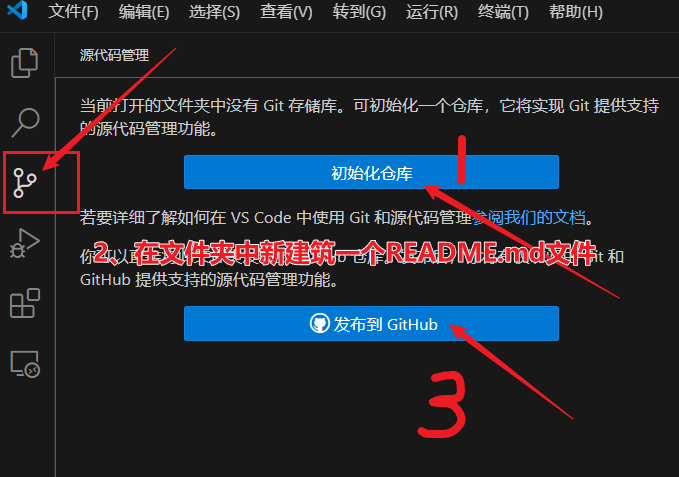

# 入门岛
# 第三关 Git 基础知识
## 一、Git 密钥对配置笔记：
ssh-keygen：（几点没人讲的说明：）

1. 每台电脑密钥对是可以共用的！！！
也就是说你可以指定一个密钥对去登陆各种远程主机！没必要生成很多个密钥对，难管理。但共用密钥对安全性没有多个密钥对高。

2. 所有终端，只要能运行ssh-keygen都可以创建密钥对，包括git bash、cmd、powershell等等，只要有ssh-keygen工具的环境都是可以创建密钥对。

   ssh-keygen -t rsa -b 4096 -C "your_email@example.com"

   -t 是加密方法，不指定也可以，比如GITHUB可以不指定。不指定的密钥会比较短，指定rsa加密方法的密钥会比较长。最好指定，好像有此SSH远程必须用rsa加密，比如这个本课程中的开发机。

   -C（大写的C）注释，公钥的末尾会变成...your_email@example.com,一般没必要。
   -b 加密后的密钥长度，rsa一般2048或4096,一般不指定；

3. <u>C:\Users\用户名\.ssh</u> &nbsp;&nbsp;&nbsp;是你的密钥对存放的位置，长这样，都可以用记事本打开：

   

   ### 共用密钥对有个麻烦事儿就是你一旦删除了上述文件夹的密钥对，所有的远程都嗝屁了并需要重新配置；

## 二、VSCODE 管理 github 代码中的几个概念
### 工作目录：
    就是本机上看到的你的项目文件夹；

### 缓存区：
    必须git init后,在工作目录中有个隐藏文件夹.git，里面有个名为index的文件，这个文件就是缓存区，它缓存的并不是文件，而是文件索引，是个二进制文件代码，打开也看不懂，缓存的文件统一放在工作目录中的objects文件夹中，里面全是被二进制化后的原始文件，打开也是啥也看不懂（git add .后才会进入到缓存区内，你可以认为这个index就是缓存区的直观存在，当然不准确，它只是个索引。）

### 本地仓库：
    在.git文件中其余文件（除了index外）就全是本地代码的仓库了，里面包含了版本管理、原始的元数据、提交的历史、分支信息等等。（git commit . 后你编辑的代码才会全部进入到.git本地代码仓库内）
### 远程仓库：
    就是你打开网页看到的gitub的页面（必须git push后才会看到）

# 三、发布第一个Github项目，利用VSCODE管理gitub代码
自认为最简单的办法（截止20241002）：

第一步--->在自己建个目录，想放哪儿放哪儿

第二步--->打开vscode -->文件-->打开文件夹-->打开你刚才那个文件夹，在资源管理器中你会看到你的文件夹，代表已经成功打开了；

第三步--->切换至 源代码管理 按纽，初始化仓库（1），这样会在你本地的文件夹中生成一个.git文件夹，代码开始进行记录管理代码。进入你的本地工作文件夹，新建一个READ.md文件（2），空的就行。至此就建立了一个最简单的本地代码仓库！！！

第四步--->直接点发布到GitHub,一路YES，大功告成！你点开“在GitHub网页查看”就能发现你的本地代码仓就推送到github上你的ID下啦！！！

四、 vscode中进行ssh连接不成功没反应的解决办法

# 问题：

在命令面板中点完“连接到主机...”就没反应了，并不会出现“添加新的ssh主机..."选项

# 解决办法：

删除.ssh文件夹中的config文件，重启vscode，再操作一遍就会“添加新的ssh主机..."选项

# 麻烦：要是有多个主机，这样删除就比较麻烦，需要重新配置一遍，所以备分完成再删除，等成功了再把主机信息再添加回config文件可能是个补救的办法。