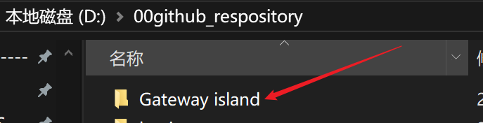
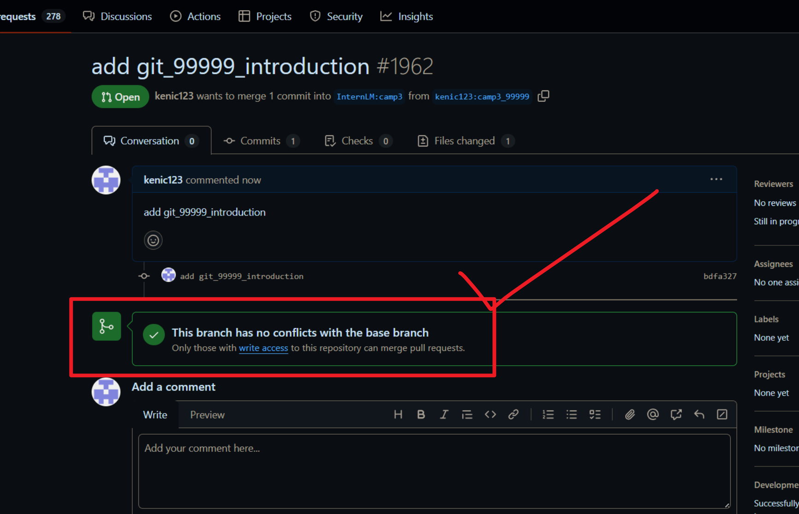

# 入门岛
# 第三关 Git 基础知识
## 一、Git 密钥对配置笔记：
ssh-keygen：（几点没人讲的说明：）

1. 每台电脑密钥对是可以共用的！！！
也就是说你可以指定一个密钥对去登陆各种远程主机！没必要生成很多个密钥对，难管理。但共用密钥对安全性没有多个密钥对高。

2. 所有终端，只要能运行ssh-keygen都可以创建密钥对，包括git bash、cmd、powershell等等，只要有ssh-keygen工具的环境都是可以创建密钥对。

   ssh-keygen -t rsa -b 4096 -C "your_email@example.com"

   -t 是加密方法，不指定也可以，比如GITHUB可以不指定。不指定的密钥会比较短，指定rsa加密方法的密钥会比较长。最好指定，好像有此SSH远程必须用rsa加密，比如这个本课程中的开发机。

   -C（大写的C）注释，公钥的末尾会变成...your_email@example.com,一般没必要。
   -b 加密后的密钥长度，rsa一般2048或4096,一般不指定；

3. <u>C:\Users\用户名\.ssh</u> &nbsp;&nbsp;&nbsp;是你的密钥对存放的位置，长这样，都可以用记事本打开：

   

   ### 共用密钥对有个麻烦事儿就是你一旦删除了上述文件夹的密钥对，所有的远程都嗝屁了并需要重新配置；

## 二、VSCODE 管理 github 代码中的几个概念
### 工作目录：
    就是本机上看到的你的项目文件夹；

### 缓存区：
    必须git init后,在工作目录中有个隐藏文件夹.git，里面有个名为index的文件，这个文件就是缓存区，它缓存的并不是文件，而是文件索引，是个二进制文件代码，打开也看不懂，缓存的文件统一放在工作目录中的objects文件夹中，里面全是被二进制化后的原始文件，打开也是啥也看不懂（git add .后才会进入到缓存区内，你可以认为这个index就是缓存区的直观存在，当然不准确，它只是个索引。）

### 本地仓库：
    在.git文件中其余文件（除了index外）就全是本地代码的仓库了，里面包含了版本管理、原始的元数据、提交的历史、分支信息等等。（git commit . 后你编辑的代码才会全部进入到.git本地代码仓库内）
### 远程仓库：
    就是你打开网页看到的gitub的页面（必须git push后才会看到）

# 三、发布第一个Github项目，利用VSCODE管理gitub代码
自认为最简单的办法（截止20241002）：

第一步--->在自己建个目录，想放哪儿放哪儿

第二步--->打开vscode -->文件-->打开文件夹-->打开你刚才那个文件夹，在资源管理器中你会看到你的文件夹，代表已经成功打开了；

第三步--->切换至 源代码管理 按纽，初始化仓库（1），这样会在你本地的文件夹中生成一个.git文件夹，代码开始进行记录管理代码。进入你的本地工作文件夹，新建一个READ.md文件（2），空的就行。至此就建立了一个最简单的本地代码仓库！！！

第四步--->直接点发布到GitHub,一路YES，大功告成！你点开“在GitHub网页查看”就能发现你的本地代码仓就推送到github上你的ID下啦！！！

四、 vscode中进行ssh连接不成功没反应的解决办法

# 问题：

在命令面板中点完“连接到主机...”就没反应了，并不会出现“添加新的ssh主机..."选项

# 解决办法：

删除.ssh文件夹中的config文件，重启vscode，再操作一遍就会“添加新的ssh主机..."选项

# 麻烦：要是有多个主机，这样删除就比较麻烦，需要重新配置一遍，所以备分完成再删除，等成功了再把主机信息再添加回config文件可能是个补救的办法。

---
---
---
# 入门岛第三关用到的几个命令：
1、一定要先在开发机里建个目录，不然会比较乱，然后在github上fork完项目克隆到远程的开发机里：git clone 地址

2、进入到Tutorial目录执行git branch -a 查看所有分支信息，确保自己是在camp3分枝上，当前所在分枝前面有个“*”标志

3.然后就是基于这个分枝建一个新分枝：git checkout -b camp3_XXXID origin/camp3

4、建完分枝再按要求在data/Git/task/下面建一个mk文件：touch ./data/Git/task/camp3_xxxid.md ,并填上相应的自我介绍，ctal+s保存。

5、三步曲：
    提交缓存: git add . 
    送入本地代码库（在开发机上）：git commit -m "add git_xxxid_introduction"
    推到远程githup上你自己fork的库上：git push origin camp3_XXXID
    完活儿！！

# <u>最后说下踩过的几个大坑或是疑惑</u>
##  1、git push origin camp3_XXXID完你就可以打开githup你fork的仓库看到提示了,如果是首次提交分支，你会看到红框的提示信息，如果这个分枝再有提交，就没有了红框，只有绿框提示了，但点1 commit ahead of 字样你一样可以新建PR,这坑我迷了两个小时！

## 2、 点完,你会看到编辑PR的界面，一般前面的基础分枝你不用选，你主要选后面的对比分枝就行了，最后填好信息点下面的creat pull request就行了！
 

## 3、 最要命的点：我迷了三个小时：
    你点完creat pull request按纽，这个黄框是一闪而过的，一般不会，一般需要等着主分枝同意合并你的PR才行，但活动小组应该是设置了自动审核通过，所以，，，所以，，，这个一闪就过了，代表你直接合进了原仓库的主分枝里了！！！！

    闪过之后你会看到下面的界面：意思就是你的PR被通过并合进了原仓库的主分枝里了！！！！过家家就是快呀！！

    你可以到原仓库地址PR页就看能看到你的那个被通过的PR啦!！！记住：：只有在此时你才需要到原仓库操作，之前几步除了fork那个动作以外，你都是在你自己的ID下刚fork的界面内操作才能看到相应的结果。

    这就意味着你入门岛第三关，完成啦，哈哈哈，，，，